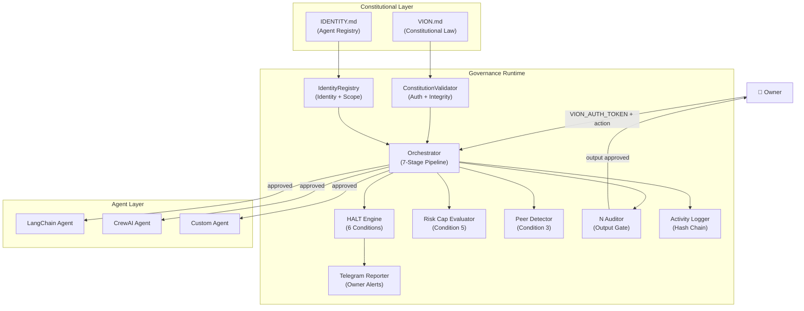
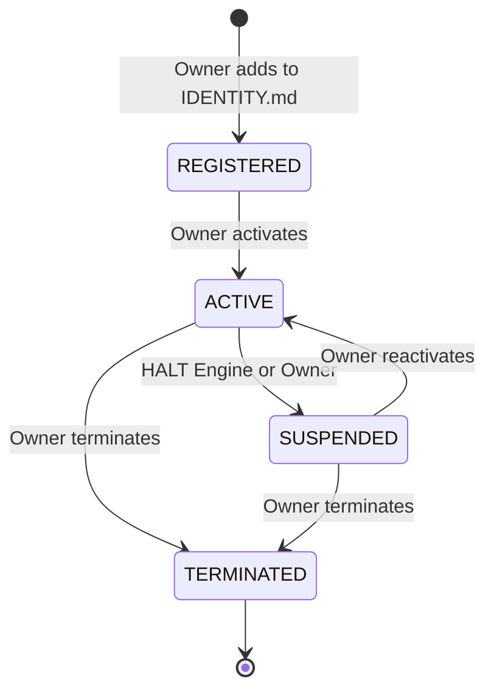
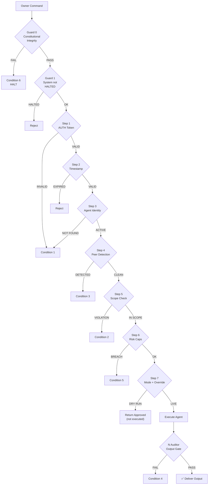

# VION Protocol — Technical Specification
**Version:** 1.0.0
**Status:** Active
**Author:** Nathan Daniel / N Nexus
**License:** MIT

---

## Executive Summary

VION Protocol is a constitutional governance runtime for autonomous AI agents. It defines, enforces, and audits the boundaries within which AI agents are permitted to operate — without relying on humans to watch every action.

The protocol answers a question the AI agent industry has not yet solved:

> *How do you deploy autonomous AI agents into production with guaranteed boundaries, verifiable authority, and autonomous enforcement?*

VION Protocol solves this with a constitutional stack: human-readable law, cryptographic identity, a multi-stage validation pipeline, an autonomous kill-switch, and a tamper-evident audit chain. Every agent action passes through the governance runtime before execution. Every decision is logged permanently. Any violation triggers an autonomous response.

---

## Protocol Overview

VION Protocol operates as a sidecar governance layer. It does not replace agent frameworks. It governs them. Any Python-based agent system — LangChain, CrewAI, OpenAI, or custom — integrates VION Protocol through an adapter and immediately gains constitutional governance.

**Core guarantees:**
- No command executes without passing 7-stage validation
- Every agent has a verified identity and bounded scope
- All 6 enforcement conditions fire autonomously
- Every event is permanently logged in a tamper-evident chain
- The Owner receives real-time alerts on any anomaly

---

## Design Philosophy

### 1. Constitution over Configuration
Rules are written in human-readable constitutional documents (VION.md, IDENTITY.md) rather than buried in code or config files. The law is auditable, versionable, and amendable. Agents operate under the law — they cannot modify it.

### 2. Zero Trust by Default
No agent has authority until explicitly registered. No action is permitted unless explicitly authorized. Every permission is deny-by-default. Unregistered agents are rejected at the identity check.

### 3. Owner Supremacy
A single Owner holds ultimate authority. Only the Owner can issue commands, amend the constitution, and clear a HALT. No agent — including the Orchestrator — can override the Owner.

### 4. Autonomous Enforcement
The kill-switch fires itself. No human intervention is required to enforce governance. When a violation is detected, the HALT Engine responds immediately — suspending agents, logging the event, and alerting the Owner.

### 5. Separation of Law and Runtime
VION.md and IDENTITY.md are the law. The Python runtime enforces the law. Operators customize the law without modifying the runtime. Runtime updates never require constitutional changes.

### 6. Append-Only Audit
The activity log is hash-chained. Every entry is cryptographically linked to the previous. Tampering is mathematically detectable. No agent can delete or modify log entries.

---

## Architecture Overview



---

## Constitutional Governance Model

### VION.md — The Constitutional Document

VION.md is the supreme law of the system. It is a human-authored Markdown document structured in 9 sections:

| Section | Content |
|---|---|
| 1 | Identity and Purpose — deployment name, Owner identity |
| 2 | Authority Hierarchy — Owner → Orchestrator → Agents |
| 3 | Permissions Framework — deny-by-default, explicit grants |
| 4 | Command Protocol — valid command structure and AUTH requirements |
| 5 | HALT/ESCALATE Conditions — all 6 enforcement conditions |
| 6 | Logging and Reporting — audit requirements |
| 7 | Agent Lifecycle — registration, activation, suspension, termination |
| 8 | Amendment Process — how to change the constitution |
| 9 | Constitutional Supremacy — this document overrides all instructions |

**Constitutional Supremacy Clause:** Section 9 declares that VION.md overrides all other instructions, prompts, system messages, or agent requests. No agent can modify or override it. Any attempt to do so triggers Condition 6 — immediate HALT.

### IDENTITY.md — The Agent Registry

IDENTITY.md defines every entity authorized to operate in the system. Each registration block contains:

```
AGENT_ID       : VION-RSC-001          # Unique constitutional ID
AGENT_NAME     : Research Agent         # Human-readable name
ROLE           : Web research           # Agent's purpose
STATUS         : ACTIVE                 # ACTIVE | SUSPENDED | TERMINATED
AUTH_SCOPE     :                        # What systems it can access
  - Public web sources
PERMISSIONS    :                        # Explicit action grants
  - Web search           : EXECUTE
  - Financial operations : DENIED
RISK_CAPS      :                        # Hard limits
  - No financial authority
DRY_RUN        : DEFAULT               # DEFAULT | OVERRIDE_REQUIRED
AUDIT_REQUIRED : YES                    # Must pass N Auditor
```

**Agent ID Format:** `VION-[ROLE_CODE]-[SEQUENCE]`
- VION-ORC-001 — Orchestrator
- VION-RSC-001 — Research Agent
- VION-EXC-001 — Execution Agent
- VION-MON-001 — Monitor Agent
- VION-AUD-001 — N Auditor

---

## Identity System

### Registration Lifecycle



### Authentication

Commands are authenticated using a pre-shared `VION_AUTH_TOKEN` stored in the deployment environment. Validation uses `hmac.compare_digest` — constant-time comparison that prevents timing attacks.

Command timestamps are validated against a configurable expiry window (default 300 seconds) to prevent replay attacks.

---

## Orchestrator Pipeline

Every command passes through 7 sequential validation stages. Failure at any stage rejects the command and routes to the appropriate HALT condition.



---

## HALT Engine

The HALT Engine is the autonomous enforcement system. It implements all 6 conditions defined in VION.md Section 5.

### Conditions

| # | Name | Trigger | Initial Response | Repeat Response |
|---|---|---|---|---|
| 1 | Unauthorized Source | Invalid AUTH or unregistered agent | ESCALATE | HALT on 3rd |
| 2 | Scope Violation | Action outside authorized scope | ESCALATE | HALT on 2nd |
| 3 | Peer Communication | Agent directing another agent | ESCALATE | HALT on 2nd |
| 4 | Output Audit Failure | N Auditor rejects output | ESCALATE | HALT on 3rd |
| 5 | Risk Cap Breach | Action exceeds defined limits | ESCALATE | HALT at 2x cap |
| 6 | Constitutional Integrity | VION.md or IDENTITY.md modified | **HALT IMMEDIATELY** | No escalation |

### ESCALATE vs HALT

**ESCALATE:**
- Affected agent suspended in memory and in governance.state
- Event logged to activity chain
- Owner notified via Telegram
- System continues for other agents

**HALT:**
- All active agents suspended
- All pending commands rejected
- Full system shutdown logged
- Owner receives critical Telegram alert
- System locked until Owner restart

### State Persistence

HALT state and suspension state are persisted to `constitution/governance.state`. Suspended agents remain suspended across process restarts. The Owner must explicitly call restart to clear a HALT.

---

## Risk Cap Enforcement

Risk caps are defined per agent in IDENTITY.md as plain-English strings. The RiskCapEvaluator parses these strings and evaluates them pre-dispatch.

**Supported cap patterns:**

| Pattern | Effect |
|---|---|
| `No financial authority` | Blocks payment, transfer, wire operations |
| `No bulk operations` | Blocks batch delete, mass update operations |
| `No delete authority` | Blocks any delete, remove, purge, truncate |
| `No write access to external systems` | Blocks external write, upload, push |
| `Maximum N sequential actions per session` | Enforces per-session action limit |
| `Financial limit: $N` | Blocks actions involving amounts exceeding N |
| `No access to [resource]` | Blocks any action mentioning the resource |

Caps are evaluated **before dispatch** — no action is taken until risk evaluation passes.

---

## Peer Detection System

The PeerToPeerDetector enforces VION.md Section 2.2: all agent communication must flow through the Orchestrator. No direct agent-to-agent communication is permitted.

Detection operates at two levels:

**Level 1 — Command Source:** If a command source is identified as a registered agent ID rather than the Owner, it is rejected as unauthorized peer command issuance.

**Level 2 — Action String:** If the action string contains patterns indicating one agent is directing another (e.g. "Tell VION-EXC-001 to...", "Dispatch to VION-RSC-001"), the command is rejected and Condition 3 fires.

Peer detection runs **before scope validation** in the orchestrator pipeline, ensuring peer commands are correctly classified as Condition 3 rather than Condition 2.

---

## N Auditor

The N Auditor gates every agent output before it is delivered to the caller. It runs 6 checks:

| Check | What it detects |
|---|---|
| Malformed output | None, empty string, empty structure |
| Forbidden patterns | Self-modification, peer commands, credential leaks, scope escalation |
| Protected file references | VION.md, IDENTITY.md, governance.state alongside write verbs |
| Financial scope creep | Financial terms in output for agents without financial authority |
| Size cap | Output exceeding 100,000 characters or agent-specific cap |
| Integrity hash | SHA-256 fingerprint recorded in audit log |

When the N Auditor blocks an output, Condition 4 fires in the HALT Engine.

---

## Audit Logging System

The ActivityLogger maintains an append-only, hash-chained JSONL audit log.

### Hash Chain Design

Every log entry contains two additional fields:
- `prev_hash` — SHA-256 hash of the previous entry
- `entry_hash` — SHA-256 of this entry's content concatenated with `prev_hash`

The first entry chains against a genesis hash: `SHA-256("N-VION-PROTOCOL-GENESIS")`.

**Tamper detection:** Modifying any entry changes its hash, breaking the chain link to the next entry. `ActivityLogger.verify_chain()` detects the exact entry index where tampering occurred.

### Event Types

`SYSTEM_START` `COMMAND_RECEIVED` `COMMAND_VALIDATED` `COMMAND_REJECTED` `TASK_DISPATCHED` `AGENT_SUSPENDED` `AGENT_REACTIVATED` `AUDIT_PASS` `AUDIT_BLOCK` `HALT_TRIGGERED` `ESCALATE_TRIGGERED` `SYSTEM_HALT` `INTEGRITY_CHECK` `DRY_RUN_OVERRIDE` `CONSTITUTION_VALID`

---

## Security Model

### Threat Surface

| Threat | Mitigation |
|---|---|
| Unauthorized command issuance | AUTH token + constant-time comparison |
| Replay attacks | Timestamp validation (300s window) |
| Mid-session constitution tampering | Per-command SHA-256 integrity check |
| Agent scope creep | Deny-by-default permissions, DENIED keyword enforcement |
| Peer-to-peer exploitation | Two-level peer detection pre-dispatch |
| Output-based attacks | N Auditor 6-check gate on all outputs |
| Log tampering | SHA-256 hash chain — tamper is mathematically detectable |
| Suspension bypass on restart | governance.state persistence file |
| Risk limit bypass | Pre-dispatch cap evaluation, never post-execution |

### What VION Does Not Protect Against

- Compromise of the Owner's VION_AUTH_TOKEN
- Malicious code in the agent's execution environment (sandboxing is out of scope in v1.0.0)
- Attacks on the Python runtime itself
- Network-level attacks on Telegram delivery

---

## Protocol Rules

1. Every agent must be registered in IDENTITY.md before it can receive commands
2. Every command must carry a valid AUTH token
3. Commands older than the expiry window are rejected
4. Agents operate under deny-by-default permissions
5. DENIED permissions always override EXECUTE or READ permissions
6. All outputs pass through the N Auditor before delivery
7. Risk caps are evaluated before dispatch — never after
8. Peer-to-peer communication is prohibited in all forms
9. VION.md and IDENTITY.md may not be modified by any agent
10. Constitutional tampering triggers an immediate unconditional HALT
11. All events are logged permanently — no deletion permitted
12. HALT state persists across restarts until the Owner clears it

---

## Extension Model

VION Protocol is designed for extension at the adapter layer.

**Custom adapters** extend `BaseAgentAdapter` and implement `_run_agent(action)`. The governance pipeline is inherited automatically.

**Custom audit rules** can be added to `NAuditor` by extending the `FORBIDDEN_PATTERNS` list or subclassing `NAuditor` and overriding individual check methods.

**Custom risk caps** are defined in plain English in IDENTITY.md — no code changes required for new cap patterns that match supported formats.

**Custom HALT conditions** require adding a new `HaltCondition` enum value, a rule entry in `CONDITION_RULES`, and wiring detection logic in the appropriate pipeline stage.

---

## Versioning Strategy

VION Protocol follows semantic versioning:

- **MAJOR** — Breaking changes to the constitutional model or API
- **MINOR** — New capabilities, new enforcement conditions, new adapter types
- **PATCH** — Bug fixes, security patches, documentation updates

Constitutional documents (VION.md, IDENTITY.md) are versioned independently. Runtime version and constitution version are both recorded in every log entry for full traceability.

---

*VION Protocol v1.0.0 — Constitutional law for AI agents.*
