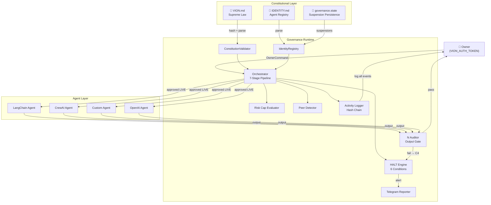
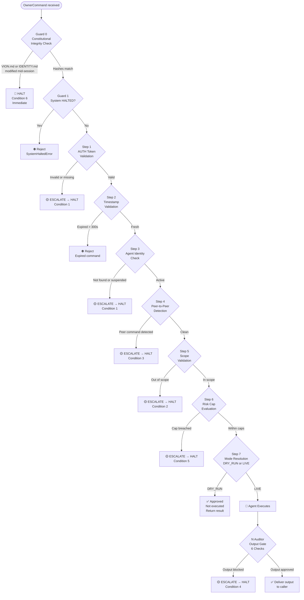
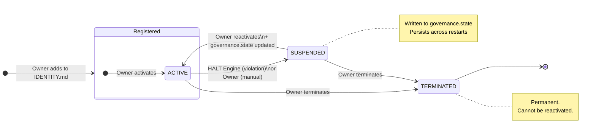
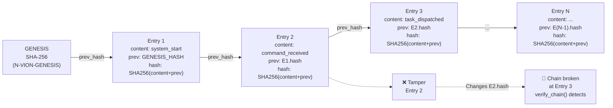
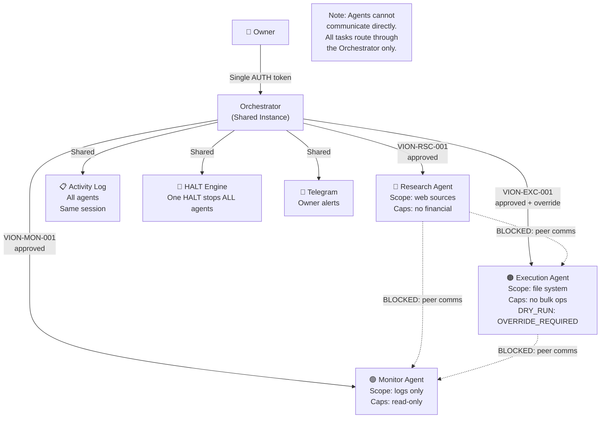
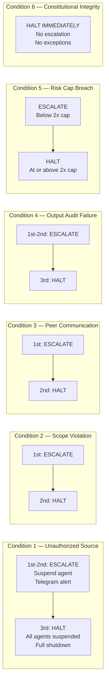

# Architecture

Visual diagrams of every VION Protocol subsystem.

---

## High-Level Architecture

---

## Orchestrator Pipeline

---

## Identity System

---

## Audit Log — Hash Chain

---

## Multi-Agent Governance

---

## HALT Condition Response Matrix

